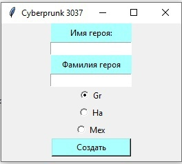
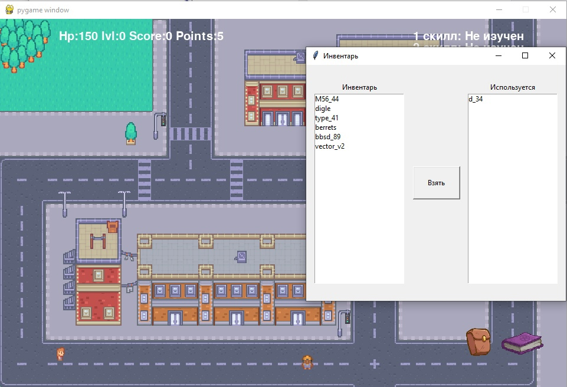
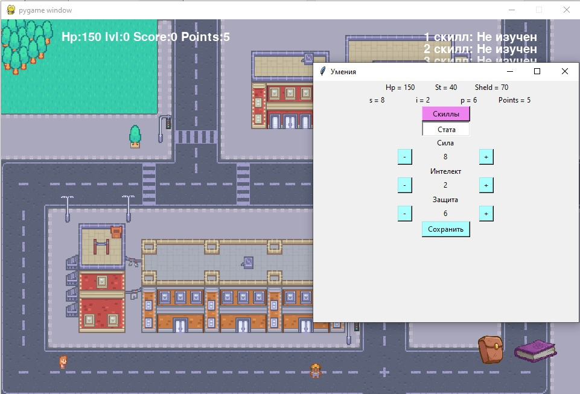

#####  Дипломный проект НАДИП "Создание 2д игры в жанре RPG"

  
В игре представлено 3 класса, все они отличаються скилами и базовыми скилпоинтами.Суть игры в том, чтобы стрелять во врагов,побеждать их, набирать очки и прокачивать скиллы.В игре есть несколько вариантов врагов все они отличаютсья количеством хп,уроном,скорострельностью.В игре так же присутствует инвентарь, в котором можно выбирать оружие, окно, в котором прокачиваються скиллы и распределяються скиллпоинты.